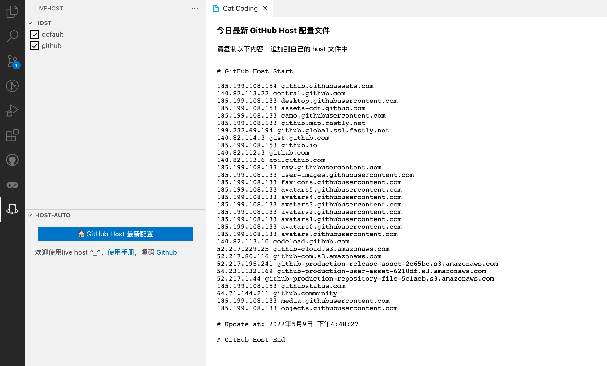

# live-host

### 项目介绍

1. Quickly edit system hosts file; 快速编辑 host 文件。

2. Get best ip about github; 每日获取最佳 github ip 解决 DNS 污染问题。

[使用文档](https://github.com/mingjiezhou/notes/issues/13)

[源码](https://github.com/mingjiezhou/live-host)

[问题反馈](https://github.com/mingjiezhou/live-host/issues)

